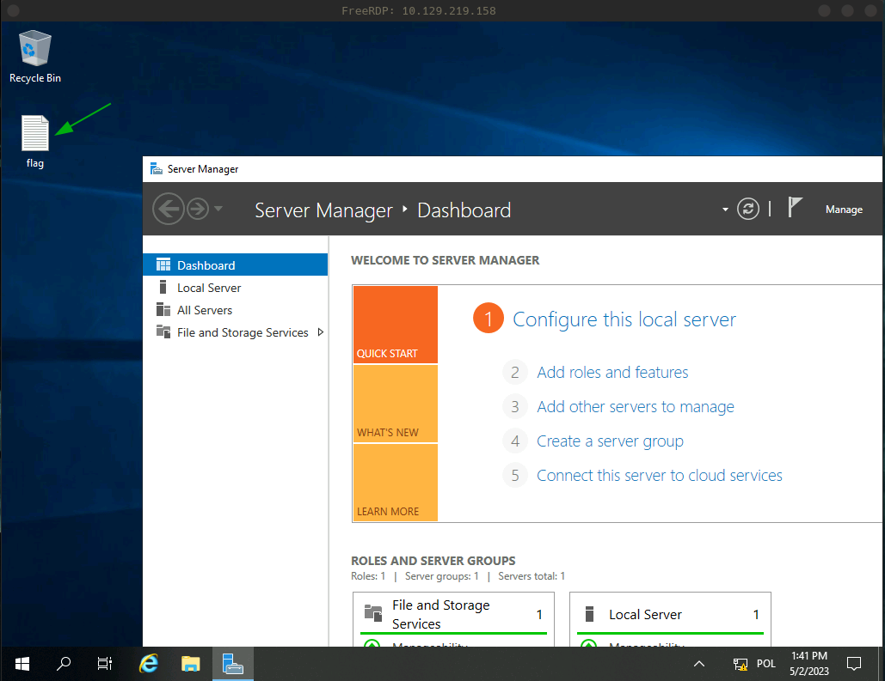

## Description
The second Starting Point Tier 0 Windows machine, this time presenting an inproper use of RDP protocol.

## Enumeration
Let's start with an Nmap scan to enumerate open ports on the target system.
```
$ sudo nmap -F -sV --reason $ip

PORT     STATE SERVICE       REASON          VERSION
135/tcp  open  msrpc         syn-ack ttl 127 Microsoft Windows RPC
139/tcp  open  netbios-ssn   syn-ack ttl 127 Microsoft Windows netbios-ssn
445/tcp  open  microsoft-ds? syn-ack ttl 127
3389/tcp open  ms-wbt-server syn-ack ttl 127 Microsoft Terminal Services
Service Info: OS: Windows; CPE: cpe:/o:microsoft:windows
```
Based on the open ports one can deduce that the target machine is running Windows. There's an RDP port open - `3389`.

## Foothold
Let's try to connect using the `Administrator` account with `xfreerdp` - an RDP client.
```
$ xfreerdp /u:Administrator /p:"" /v:$ip
[...]
Do you trust the above certificate? (Y/T/N) Y
```
Turns out the RDP service does not require a password to connect to the system using the `Administrator` account. A windows with a remote GUI session to the target system is displayed by `xfreerdp`. The flag file is on the Desktop.


## Summary
Explosion is a simple machine which shows how inproperly secured Remote Desktop Protocol service running on a Windows system can give an attacker easy access to the machine. 

## Resources
[RDP wikipedia article](https://en.wikipedia.org/wiki/Remote_Desktop_Protocol)
[Pentesting RDP](https://book.hacktricks.xyz/network-services-pentesting/pentesting-rdp)
